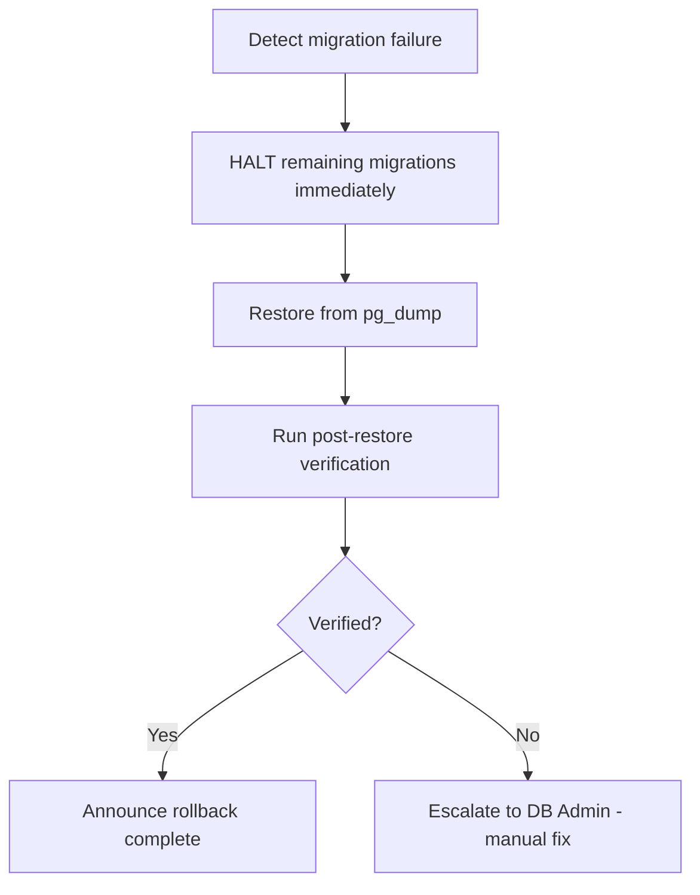

# Production Rollback Runbook — Phase 2C

**Prepared:** 2026-07-30  
**Rollback method:** Database restore from pre-deployment dump + app revert to previous build  

---

## Rollback Triggers

| Level | Trigger | Action | Owner | Deadline |
|-------|---------|--------|-------|----------|
| **L1** | Failed verification at T+30 checkpoint (migrations 007–015) | Immediate full rollback | DB Admin | T+45 |
| **L2** | Failed verification at T+60 checkpoint (migrations 016–022) | Immediate full rollback | DB Admin | T+75 |
| **L3** | Post-migration verification fails (permission count, policy count, FK count) | Immediate full rollback | DB Admin | T+90 |
| **L4** | Application smoke test fails (auth, CRUD, routing) | Gentle rollback (app revert first, then DB) | Engineering | T+120 |
| **L5** | Error rate > 1% during stabilization window | Gentle rollback | Engineering | T+180 |
| **L6** | Data integrity issue discovered (orphan records, missing FKs) | Emergency rollback — may require manual data fix | DB Admin + Engineering | T+240 |

---

## Rollback Sequences

### Sequence A: Immediate Full Rollback (L1–L2)

Use when a migration fails during execution and the production database is not yet in a consistent state.



**Steps:**

1. **HALT** — Stop all pending migration executions. `SELECT pg_cancel_backend(<pid>)` if needed.
2. **NOTIFY** — Announce rollback in team channel: `[ROLLBACK] L1 rollback triggered at migration N. Reason: <error>`
3. **RESTORE** — Restore from pre-deployment dump:
   ```bash
   pg_restore -d "$PROD_DATABASE_URL" --clean --if-exists --no-owner --no-privileges /tmp/prod_pre_deploy.dump
   ```
4. **VERIFY** — Run verification queries to confirm pre-deployment state:
   ```sql
   SELECT count(*) FROM permissions;                    -- Should match pre-deploy count
   SELECT count(*) FROM pg_policies;                     -- Should match pre-deploy count
   SELECT count(*) FROM information_schema.tables 
     WHERE table_schema = 'public' AND table_type = 'BASE TABLE';  -- Should match pre-deploy count
   ```
5. **APP ROLLBACK** — Revert application to previous build:
   ```bash
   git checkout <pre-deployment-tag>
   npm run build
   # Deploy previous build to hosting platform
   ```
6. **CONFIRM** — Load production URL, confirm app works with restored database.

**Estimated time:** 20–30 minutes.

---

### Sequence B: Gentle Rollback (L4–L5)

Use when migrations succeeded but application has issues. This preserves the database schema but reverts the app.

**Steps:**

1. **ANALYZE** — Determine if the issue is app-only or schema-related.
2. **APP REVERT** — Revert application to previous build:
   ```bash
   git checkout v1.0.0  # previous stable tag
   npm run build
   # Deploy to hosting platform
   ```
3. **TEST** — Verify app works with current schema.
4. **DECIDE** — If app works with new schema but old app, the issue is in the new app code (not migrations). Proceed with app fix. If app does NOT work with new schema, proceed to Sequence A.

**Estimated time:** 10–15 minutes.

---

### Sequence C: Emergency Rollback (L6)

Use when data integrity issues are discovered during the stabilization window. This requires data reconciliation, not just rollback.

**Steps:**

1. **FREEZE** — Put the application in maintenance/read-only mode.
2. **ASSESS** — Determine the scope of data integrity issues:
   ```sql
   -- Check for orphan beneficiary assignments
   SELECT count(*) FROM beneficiary_assignments ba
     LEFT JOIN beneficiaries b ON b.id = ba.beneficiary_id
     WHERE b.id IS NULL;

   -- Check for missing FK references in followups
   SELECT count(*) FROM followups f
     LEFT JOIN servants s ON s.id = f.servant_id
     WHERE s.id IS NULL;
   ```
3. **DECIDE** — One of three paths:
   - **Path C1 (low impact):** Fix data directly via SQL, proceed without rollback.
   - **Path C2 (medium impact):** Rollback via Sequence A, then fix and re-deploy.
   - **Path C3 (high impact):** Rollback via Sequence A, lock the deployment pipeline, root cause analysis required.
4. **EXECUTE** — Chosen path.
5. **POST-MORTEM** — Schedule root cause analysis within 24 hours.

---

## Per-Migration Undo Commands

If a single migration fails and you want to manually undo it (without full rollback), use these commands. **Only for advanced DBAs.**

### Migration 007 (services table)

```sql
-- Drop services table and its dependent FKs
DROP TABLE services CASCADE;
-- Restore ministries table
ALTER TABLE ministries_backup_20260730 RENAME TO ministries;
```

### Migration 008 (classes table)

```sql
DROP TABLE classes CASCADE;
```

### Migration 009 (churches +3 cols)

```sql
ALTER TABLE churches DROP COLUMN contact_email;
ALTER TABLE churches DROP COLUMN contact_phone;
ALTER TABLE churches DROP COLUMN address_ar;
ALTER TABLE churches DROP COLUMN address_en;
ALTER TABLE churches DROP COLUMN subscription_tier;
ALTER TABLE churches DROP COLUMN subscription_status;
ALTER TABLE churches DROP COLUMN trial_ends_at;
ALTER TABLE churches DROP COLUMN feature_flags;
ALTER TABLE churches DROP COLUMN locale;
```

### Migration 010 (profiles +2 cols)

```sql
ALTER TABLE profiles DROP COLUMN spiritual_title;
ALTER TABLE profiles DROP COLUMN preferred_language;
ALTER TABLE profiles DROP COLUMN notification_preferences;
ALTER TABLE profiles DROP COLUMN last_login_at;
```

### Migration 011 (servants table)

```sql
DROP TABLE servants CASCADE;
```

### Migration 012 (servant_stage_assignments)

```sql
DROP TABLE servant_stage_assignments CASCADE;
-- Restore backup
ALTER TABLE user_stage_assignments_backup_20260730 RENAME TO user_stage_assignments;
```

### Migration 013 (beneficiaries rename)

```sql
ALTER TABLE beneficiaries RENAME TO children;
```

### Migration 014 (beneficiary_assignments)

```sql
DROP TABLE beneficiary_assignments CASCADE;
ALTER TABLE beneficiaries ADD COLUMN stage_id uuid REFERENCES stages(id);
```

### Migration 015 (attendance restructure)

```sql
DROP TABLE attendance_records CASCADE;
DROP TABLE attendance_sessions CASCADE;
ALTER TABLE attendance_backup_20260730 RENAME TO attendance;
```

### Migration 016 (followups update)

```sql
-- Reverse deleted_at addition
ALTER TABLE followups DROP COLUMN deleted_at;
-- Restore stage_id
ALTER TABLE followups ADD COLUMN stage_id uuid REFERENCES stages(id);
-- Restore old enum
DROP TYPE followup_status CASCADE;
ALTER TYPE followup_status_old RENAME TO followup_status;
```

### Migration 017 (spiritual journal entries)

```sql
DROP TABLE spiritual_journal_entries CASCADE;
```

### Migration 018 (notifications update)

```sql
-- Reverse column drops
ALTER TABLE notifications ADD COLUMN channel_value text;
ALTER TABLE notifications RENAME COLUMN channel TO old_type;
ALTER TABLE notifications RENAME COLUMN channel_value TO channel;
ALTER TABLE notifications RENAME COLUMN recipient_id TO user_id;
ALTER TABLE notifications DROP COLUMN notification_type;
ALTER TABLE notifications DROP COLUMN is_read;
ALTER TABLE notifications DROP COLUMN data;
```

### Migration 019 (audit logs update)

```sql
ALTER TABLE audit_logs ALTER COLUMN action TYPE audit_action USING action::audit_action;
ALTER TABLE audit_logs RENAME COLUMN actor_id TO user_id;
ALTER TABLE audit_logs ADD COLUMN ip_address inet;
ALTER TABLE audit_logs ADD COLUMN user_agent text;
ALTER TABLE audit_logs ALTER COLUMN entity_id DROP NOT NULL;
ALTER TABLE audit_logs DROP COLUMN metadata;
```

### Migration 020 (user_roles update)

```sql
ALTER TABLE user_roles ALTER COLUMN assigned_by DROP NOT NULL;
ALTER TABLE user_roles DROP COLUMN start_date;
-- Restore original data from backup (if available)
```

### Migration 021 (role & permissions)

```sql
-- Restore deleted permission codes
INSERT INTO permissions (code, name_ar, name_en, module) VALUES
  ('users.create', 'إنشاء مستخدم', 'Create User', 'users'),
  ('users.delete', 'حذف مستخدم', 'Delete User', 'users'),
  ('users.manage', 'إدارة المستخدمين', 'Manage Users', 'users'),
  ('attendance.update', 'تعديل الحضور', 'Update Attendance', 'attendance'),
  ('attendance.delete', 'حذف الحضور', 'Delete Attendance', 'attendance'),
  ('notifications.create', 'إنشاء إشعار', 'Create Notification', 'notifications'),
  ('churches.manage', 'إدارة الكنائس', 'Manage Churches', 'churches')
ON CONFLICT (code) DO NOTHING;
```

### Migration 022 (RLS implementation)

```sql
-- Disable RLS on all tables
SELECT 'ALTER TABLE "' || tablename || '" DISABLE ROW LEVEL SECURITY;'
FROM pg_tables WHERE schemaname = 'public' AND rowsecurity = true;

-- Drop all policies
DO $$ DECLARE rec RECORD; BEGIN
  FOR rec IN SELECT policyname, tablename FROM pg_policies WHERE schemaname = 'public'
  LOOP
    EXECUTE format('DROP POLICY IF EXISTS %I ON public.%I', rec.policyname, rec.tablename);
  END LOOP;
END $$;
```

---

## Rollback Validation

After any rollback, run these checks:

```sql
-- 1. Permissions restored
SELECT count(*) FROM permissions;

-- 2. Tables restored
SELECT table_name FROM information_schema.tables
WHERE table_schema = 'public' AND table_type = 'BASE TABLE'
ORDER BY table_name;

-- 3. Enums restored
SELECT typname, enumlabel FROM pg_type t
JOIN pg_enum e ON t.oid = e.enumtypid
ORDER BY typname, enumsortorder;

-- 4. RLS state
SELECT relname, relrowsecurity FROM pg_class
WHERE relnamespace = 'public'::regnamespace
ORDER BY relname;

-- 5. FK constraints intact
SELECT count(*) FROM pg_constraint
WHERE contype = 'f' AND connamespace = 'public'::regnamespace;
```

**Rollback success criteria:**
- Permission count matches pre-deploy count ✅
- Table list matches pre-deploy list ✅
- Enum values match pre-deploy values ✅
- RLS state matches pre-deploy state ✅
- No orphan FKs ✅
- Application login test passes ✅
