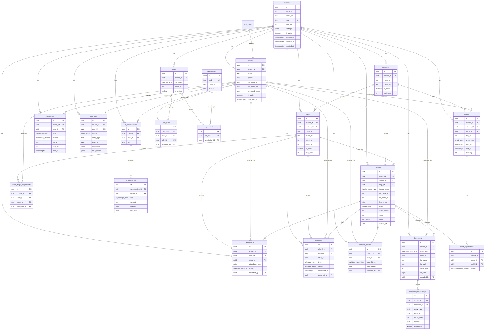
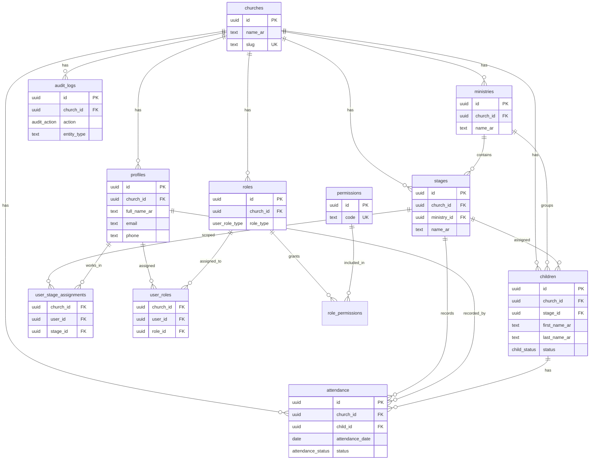

# Church Ministry CRM — Entity Relationship Diagram

## Full ERD



---

## Phase 1 ERD (Active Entities)

Phase 1 implements the highlighted subset:



---

## Relationship Summary

| From | To | Cardinality | Description |
|------|----|-------------|-------------|
| churches | ministries | 1:N | Church owns ministries |
| ministries | stages | 1:N | Ministry contains stages |
| churches | profiles | 1:N | Church has users |
| profiles | user_roles | 1:N | User can have multiple roles |
| roles | role_permissions | 1:N | Role grants permissions |
| profiles | user_stage_assignments | 1:N | User assigned to stages |
| stages | children | 1:N | Stage contains children |
| children | attendance | 1:N | Child has attendance records |
| children | followups | 1:N | Child has follow-up history |
| events | event_registrations | 1:N | Event has registrations |
| ai_conversations | ai_messages | 1:N | Conversation has messages |

---

## Key Constraints

1. **Tenant isolation**: All FK paths include `church_id` matching
2. **Unique attendance**: One record per child per date per church
3. **Unique event registration**: One registration per child per event
4. **Unique user role**: One assignment per user-role-church combination
5. **Unique stage assignment**: One assignment per user-stage-church combination
6. **Soft delete**: `deleted_at` on churches, ministries, stages, children, events, documents

---

## Index Strategy

```
Search by name:     (church_id, last_name_ar, first_name_ar)
Search by mobile:   (church_id, mobile), (church_id, parent_phone)
Stage lookups:      (church_id, stage_id), (church_id, ministry_id)
Attendance by date: (church_id, attendance_date), (church_id, stage_id, attendance_date)
Audit history:      (church_id, created_at DESC)
User lookups:       (church_id, email), (church_id, phone)
```
